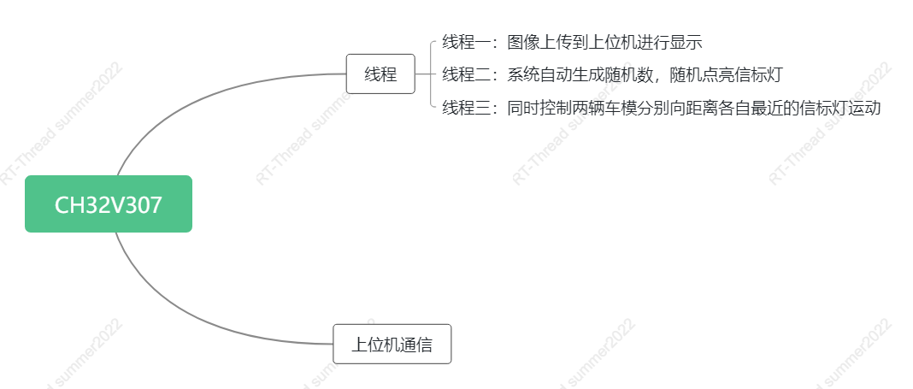

# RT-Thread-summer2022

## 作品简介

​		本作品基于十七届全国大学生智能车竞赛平衡信标组的群体挑战赛规则改编。由于场地以及器材限制，因此只能在单片机上仿真。限定一个60*80的区域，每一个像素点都可以作为信标灯被点亮，另设定两个点(30,60),(50,60)作为车模的初始位置。系统生成两组随机数，作为信标灯的坐标，然后计算各车与各灯的距离，控制车模分别向距离自己最近的灯运动。当车出现在灯周围3 * 3的范围内时，即视为灯被触发，系统随机生成下一个灯的坐标并将其点亮，由此往复。

## RT-Thread使用情况及软件框架

​		线程一：更新图像，并将图像上传到上位机，由上位机进行显示；线程二：系统自动生成随机数作为信标灯的坐标，将其点亮；线程三：同时控制两辆车模分别向距离各自最近的信标灯运动。通过三个线程的互相调度，实现多车协同灭灯，将RT-Thread的实时性体现出来，体现操作系统与裸机开发的区别。

​		与上位机通信部分原计划使用esp8266芯片搭配中南大学开源图传上位机“致用图传”进行图像传输，但因该部分原因，本部分总存在一些bug，无法完成，不得已选用下策，即使用是uart串口输出运行状况，未来我会不断尝试该部分的实现。

