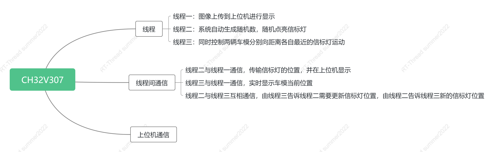

# RT-Thread-summer2022

## 作品简介

​		本作品基于十七届全国大学生智能车竞赛平衡信标组的群体挑战赛规则改编而来，实现了单片机随机在60*80的区域内点亮两个信标灯，同时控制两个车模向信标灯运动，当车出现在灯周围时，即视为灯被触发，下一个灯点亮，由此往复。

## RT-Thread使用情况及软件框架

​		该作品可分为三大部分：各线程，各线程通信，与上位机通信显示图像。

​		线程一：图像上传到上位机进行显示；线程二：系统自动生成随机数，随机点亮信标灯；线程三：同时控制两辆车模分别向距离各自最近的信标灯运动。通过三个线程的协调调度，将RT-Thread的实时性体现出来，体现操作系统与裸机开发的区别。

​		通信方面有三部分的通信，线程二与线程一通信，传输信标灯的位置，并在上位机显示；线程三与线程一通信，实时显示车模当前位置；线程二与线程三互相通信，由线程三告诉线程二需要更新信标灯位置，由线程二告诉线程三新的信标灯位置。

​		与上位机通信使用的是…………(==待扩充==)

